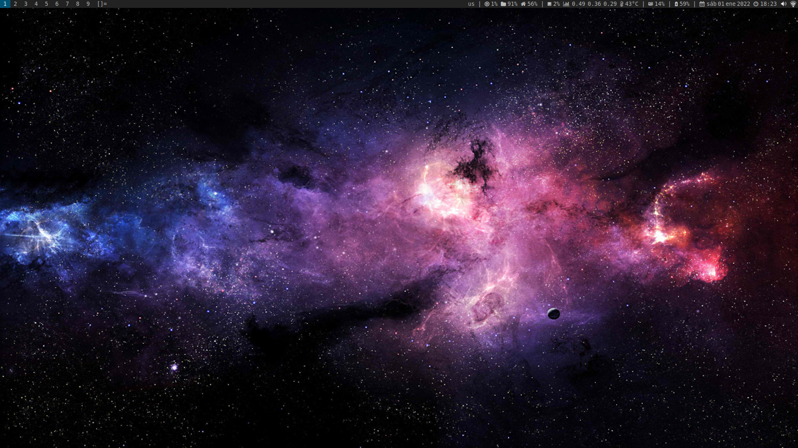
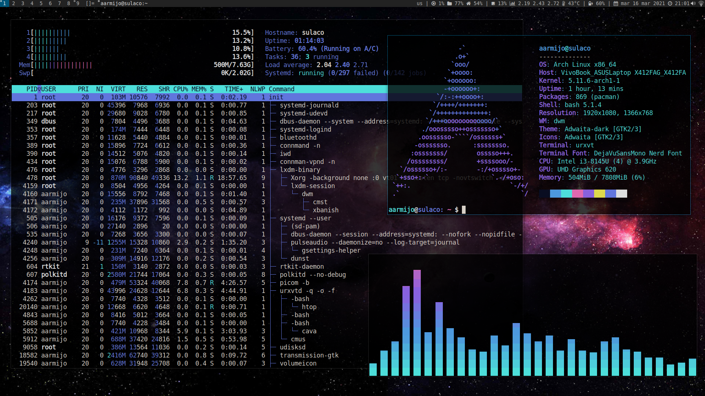

# dwm
PKGBUILD with custom configuration and patches files for dwm-6.4.





# Install
```
git clone https://github.com/arielarmijo/dwm.git
cd dwm
makepkg -sci
```
# Patches

- [attachbelow](https://dwm.suckless.org/patches/attachbelow/)
- [cfacts](https://dwm.suckless.org/patches/cfacts/)
- [cycle layouts](https://dwm.suckless.org/patches/cyclelayouts/)
- [pertag](https://dwm.suckless.org/patches/pertag/)
- [resizecornes](https://dwm.suckless.org/patches/resizecorners/)
- [save floats](https://dwm.suckless.org/patches/save_floats/)
- [scratchpads](https://dwm.suckless.org/patches/scratchpads/)
- [stacker](https://dwm.suckless.org/patches/stacker/)
- [staticstatus](https://dwm.suckless.org/patches/staticstatus/)
- [status2d with systray](https://dwm.suckless.org/patches/status2d/)
- [titlecolor](https://dwm.suckless.org/patches/titlecolor/)
- [urgentcolor](patches/dwm-urgentcolor.diff)
